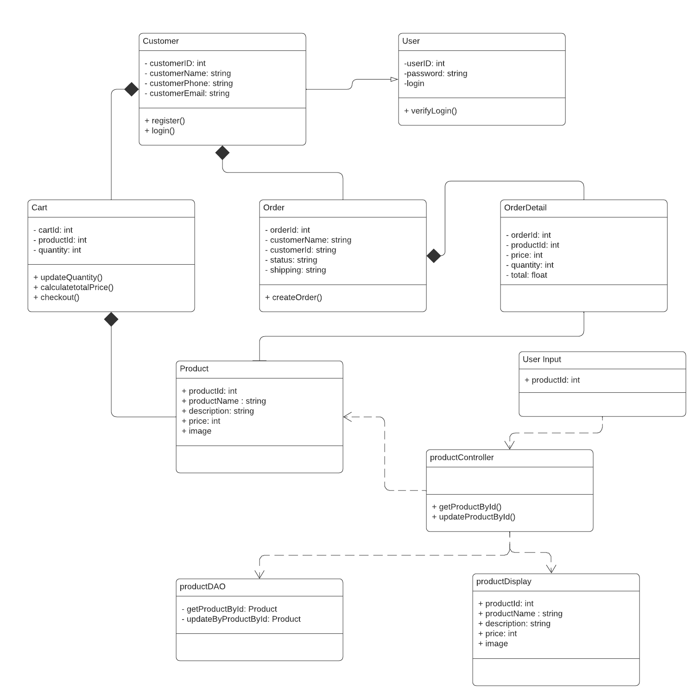
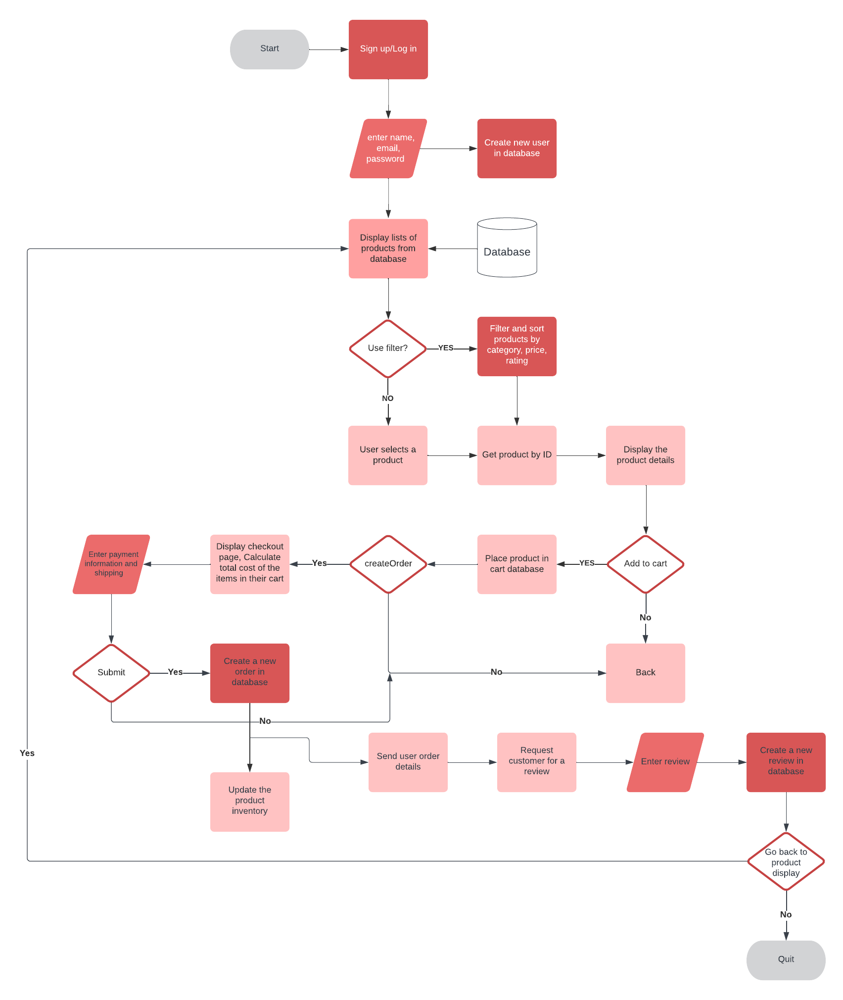
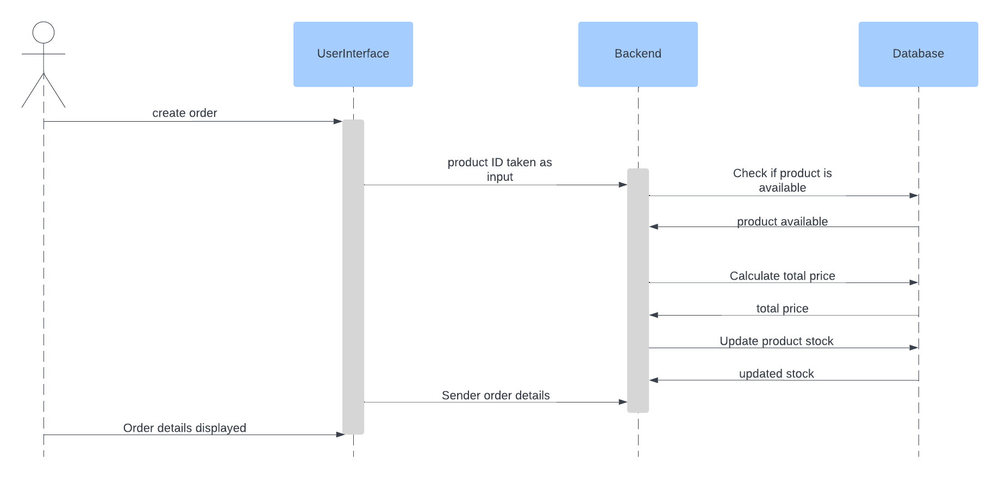

# E-commerce Design Assignment

A generic E-commerce website system design

## Part one

## System design

**Show product details**

The customer inputs their details in the login/signup section and they are stored in the database which allow customers to login next time.
The user input interface takes in the product ID and sends it to the ProductController.The ProductController acts as an interface between the web application and the back-end logic. It contains the getProductByID and updateProductByID functions, which call the corresponding functions in ProductDAO(data access object) to retrieve and update product information. The product is then returned to the user interface.
This system design also shows that when the user creates an order, it calls the functions in the product controller.
 
 

## Algorithm design and Complexity analysis

Functions:
Get product by ID
Update product by ID
Create order

Get product by ID 
For this example, the products will be automatically sorted ascendingly. And this function will look for the product using binary search hence the complexity will be O(log n).

Pseudocode:

function getproductById(id):

products = get all products from database

left = 0

right = length of products - 1

    while left <= right:
        mid = (left + right) / 2

        if products[mid].id == id:
            return products[mid]
        else if products[mid].id < id:
            left = mid + 1
        else:
            right = mid - 1

    return null

Mathematically this means that n which is the number of products in the database, is being divided in half repeatedly until the product is found, and the number of times it is being divided is the result of log n. Log will always have a base of 2 unless stated otherwise.
Hence as the list increase in size, the time taken for the function to find the product will not increase drastically. Consequently the time complexity is O(log n).
 

## Part two

## System Design

**Checkout process** 
Overall flow of the system.

## Algorithm design and Complexity analysis

**Create Order**

Sequence diagram for the Create Order function.

This function has a time complexity of O(1), because it does not perform any complex operations such as searching or looping. Hence with any number of input the time taken to add a new order to the database is always the same.

Pseudocode

createOrder(products):

order = new Order()

order.products = products

order.totalPrice = calculateTotalPrice(products)

return order

This is a pseudocode if the function is O(n):

1. Create an empty order object.
2. For each product in the cart:

   a. Check if the product is available in the inventory.

   b. If the product is available, add the item to the order object.

   c. If the product is not available, remove the item from the cart.

3. Calculate the totalPrice of the order.

This is because it has to iterate over each item in the cart and check its availability in the database.

**Update product by ID**

This function has a time complexity of O(m log n). Where m is the number of product in the order list and n is the number of product in the database. The function will need to find the product ID that is listed in the order list by using some kind of binary search. Therefore the complexity is O (log n). Reducing the specific product from the stock by subtracting each the number of products ordered and the ones in stock will take longer depending on the number of inputs. Consequently, the complexity is O(m).

1.  The function retrieves the existing product object from the database using its ID. By using the same method searching as getProductById
2.  If the product is found, it updates its fields with the new data, saves it back to the database, and returns true to indicate success
